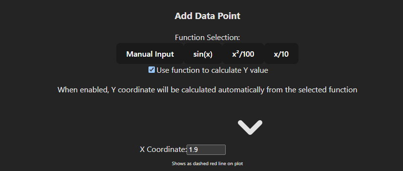

# Gaussian Process and Disagreement Visualization

## Introduction

This repo for visualizing Disagreement or Uncertainty in Gaussian Processes (GPs) to illutrasing the concepts for exploration in Reinforment Learning, especially these papers: "MaxInfoRL: Boosting exploration in reinforcement learning through information gain maximization", "Self-Supervised Exploration via Disagreement", "Curiosity-driven Exploration by Self-supervised Prediction" and "Optimistic Active Exploration of Dynamical Systems".

This interactive web application provides powerful tools for visualizing Gaussian Processes (GPs), their uncertainty, and model disagreement. Built with React, TypeScript, and D3.js, it offers an intuitive interface for exploring key concepts in probabilistic machine learning.

## Features

### 🧮 Interactive Gaussian Process Model


*Screenshot of the main GP visualization with data points and confidence bands*

- **Real-time GP inference**: Watch how the model updates as you add data points
- **Confidence bands**: Visualize model uncertainty with 1σ and 2σ confidence intervals
- **Draggable data points**: Click to add observations or drag existing points to see how the model adapts
- **Function selection**: Choose from predefined functions (sine, quadratic, linear) or add points manually

### 📊 Disagreement Visualization


*Close-up of the disagreement visualization showing multiple model samples and the guide line*

- **Sample visualization**: Generate and display multiple samples from the posterior distribution
- **Disagreement metrics**: View quantitative disagreement measures at any point in the input space
- **Interactive guide line**: Drag the vertical guide to explore model behavior at different x-values

### ⚙️ Customizable Parameters


*Screenshot of the control panel with parameter sliders and function selectors*

- **Kernel settings**: Adjust lengthscale and variance to control model smoothness
- **Noise level**: Set observation noise to model real-world data uncertainty
- **Sample count**: Control how many posterior samples to generate

### 🎬 Animation Capabilities

An animated of GP samples changing over time

- **Dynamic sampling**: Watch how samples evolve with adjustable animation speed
- **Visual learning**: Understand the stochastic nature of Gaussian processes

### Function choose

*Can choose function for y-value calculation*

- **Utility**: can easily add new data points on x-axis

## Architecture

The application is built with a modular, component-based architecture:

```
GaussianProcess/
├── GpVisualization.tsx       # Main visualization component
├── GpControls.tsx            # Parameter control interface
├── GpAnimation.tsx           # Animation logic
├── GpExplanation.tsx         # Educational explanations
├── types.ts                  # TypeScript type definitions
└── visualization/            # Modular D3.js visualization components
    ├── AxesComponent.tsx
    ├── ConfidenceBandsComponent.tsx
    ├── DataPointsComponent.tsx
    ├── GuideLineComponent.tsx
    ├── SampleLinesComponent.tsx
    └── ClickInteractionComponent.tsx
```

State management is handled with both React's useState and a Zustand store for global state, with careful synchronization between them.

## Mathematical Background

Gaussian Processes are a powerful framework for Bayesian non-parametric machine learning. Key concepts implemented in this visualization:

- **Kernel Functions**: Squared Exponential kernel with configurable lengthscale and variance
- **Posterior Distribution**: Exact inference for regression with Gaussian noise
- **Model Uncertainty**: Visualization of predictive variance
- **Disagreement Metrics**: Implementation of variance-based and information-theoretic disagreement measures

## Technical Stack

- **Frontend**: React with TypeScript
- **Build Tool**: Vite for fast development
- **Styling**: Tailwind CSS for responsive design
- **Visualization**: D3.js for interactive data visualization
- **Math Libraries**: ML-Matrix for linear algebra operations
- **State Management**: React hooks + Zustand

## Getting Started

1. Clone the repository
2. Install dependencies:
   ```bash
   npm install
   ```
3. Start the development server:
   ```bash
   npm run dev
   ```
4. Open your browser to `http://localhost:5173`

## Educational Use Cases

This tool is designed for both students and educators to gain intuition about:

- How Gaussian Processes represent uncertainty
- The impact of kernel hyperparameters on predictions
- How model disagreement can help identify areas needing more data
- The relationship between data density and prediction confidence

## Features Status

### ✅ Implemented Features
- [x] **Basic Gaussian Process visualization** with mean and confidence bands
- [x] **Interactive data points** with drag, add, and remove functionality
- [x] **Modular component architecture** for maintainable code
- [x] **Customizable parameters** for kernel functions (lengthscale, variance)
- [x] **Model animation** capabilities with adjustable speed
- [x] **Disagreement calculation and visualization** at specific x-values
- [x] **Function selection** for automated data point generation (sine, quadratic, linear)
- [x] **Responsive UI** with Tailwind CSS styling
<!-- 
### 🚧 Future Enhancements
- [ ] Additional kernel functions beyond Squared Exponential
- [ ] Model comparison tools for multiple GPs
- [ ] Data export/import functionality
- [ ] Advanced disagreement visualization modes (heatmaps, aggregated metrics)
- [ ] Mobile-friendly touch interactions
- [ ] Multi-dimensional input support (2D+ visualization)
- [ ] Batch training capabilities
- [ ] Hyperparameter optimization 
-->

## Contributing

Contributions are welcome! Whether you're fixing bugs, improving the documentation, or proposing new features, please feel free to make a pull request.
